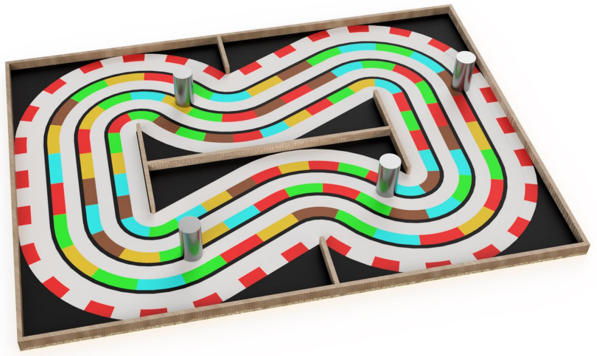

# Welcome to the LEGO-Masters-2017-Slovenia wiki!  
  
## About competition  
LEGO Masters 2017 is a annual student competition for autonomous 
mobile robots in Slovenia. Different task is issued every year by 
the LEGO Masters organisers and is given to student teams approximately 
5 mouths before the competition. The task in 2017 was to build fully 
autonomous racing robot. Robot had be able to drive around the racetrack 
in clockwise direction, avoid and navigate around obstacles, and overpass 
the opponent's vehicle. The racetrack dimensions and floor patterns were 
known in advance while obstacle positions were selected randomly before 
the start of each race. The racetrack can be seen in picture below.  
  

Robot had to be build from Lego Mindstorms EV3 kit that was supplied 
to each team by the LEGO Masters organisers. No other parts could be used. 
The software, on the other hand, could be developed in any of supported 
programming languages. 
  
## About project
This project is the result of one of the participating teams. 
The author of this project are Matej Jeglic and Peter Krapezž. 
Our plan was to develop advanced algorithms for autonomous racing robot 
in Matlab and later translate the code in the programming language *RobotC* 
which is supported by Lego Mindstorms EV3 controller unit.
  
This repository contains only the Matlab part. We built a 2D environment with 
representing the racetrack, the obstacles and the racing robot. 
Different algorithms were developed and tested using this Matlab simulation.

[Presentation video](https://youtu.be/Liks7KpLezc)
